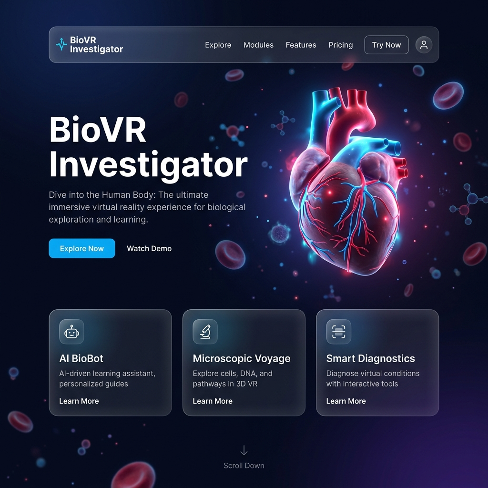

# 🫀 BioVR-Investigator

> Aplikasi Pembelajaran Interaktif 3D & AI untuk mengeksplorasi Sistem Peredaran Darah Manusia. Dibuat khusus untuk kompetisi **LIDM 2026 (Inovasi Teknologi Digital Pendidikan)**.



## 📖 Tentang Proyek
Mata pelajaran Biologi kelas XI SMA seringkali terasa kompleks dan abstrak, terutama pada bab **Sistem Peredaran Darah**. BioVR-Investigator hadir untuk memecahkan masalah miskonsepsi dan kejenuhan belajar melalui visualisasi 3D yang sangat interaktif dan asisten AI yang cerdas.

Melalui web aplikasi ini, siswa tidak lagi hanya sekadar menghafal dari buku, melainkan dapat "menyelam" masuk ke dalam ruang jantung, mengamati aliran darah, dan berinteraksi langsung dengan organ tubuh layaknya seorang detektif medis.

## ✨ Fitur Utama
1. **🔬 The Microscopic Voyage (Eksplorasi 3D):** Model jantung 3D yang dapat diputar, di-zoom, dan diklik untuk melihat detail anatomi (Atrium, Ventrikel, Katup, Pembuluh Darah).
2. **🤖 BioBot (AI Virtual Lab Assistant):** Asisten AI yang bisa diajak berbicara. BioBot dapat menjelaskan fungsi organ dan secara otomatis akan menyorot (*highlight*) bagian jantung 3D yang sedang ia jelaskan. Terintegrasi dengan *Web Speech API* untuk perintah suara.
3. **🩸 Simulasi Aliran Darah:** Visualisasi partikel sistem peredaran darah besar dan kecil secara  *real-time*.
4. **📝 Embedded Assessment:** Kuis interaktif untuk menguji pemahaman siswa setelah melakukan eksplorasi.

## 🛠️ Teknologi yang Digunakan
- **Core:** HTML5, CSS3 (Vanilla), JavaScript (ES6+)
- **Build Tool:** [Vite](https://vitejs.dev/) - Untuk *bundling* dan *development server* yang super cepat.
- **3D Engine:** [Three.js](https://threejs.org/) - Digunakan untuk mem-render jantung prosedural, partikel darah, efek pantulan/cahaya (*sub-surface scattering*), dan interaksi *Raycasting*.
- **Post-Processing:** UnrealBloomPass (Three.js) untuk memberikan efek *glow* yang realistis.
- **Animation:** [GSAP](https://gsap.com/) - Untuk transisi UI yang halus dan profesional.
- **Browser APIs:** Web Speech API (untuk fitur Suara pada BioBot).

## 🚀 Cara Menjalankan Secara Lokal (Development)

Pastikan Anda sudah menginstal **Node.js** di komputer Anda.

1. **Clone repository ini**
   ```bash
   git clone https://github.com/Soupramed/biovr-investigator.git
   cd biovr-investigator
   ```

2. **Instal dependensi**
   ```bash
   npm install
   ```

3. **Jalankan server lokal**
   ```bash
   npm run dev
   ```

4. Buka browser Anda dan akses:
   👉 **http://localhost:5173**

## 📦 Build untuk Produksi
Untuk melakukan proses *build* agar siap di-*deploy* ke hosting (seperti Vercel, Netlify, atau Firebase Hosting), jalankan:
```bash
npm run build
```
Hasil *build* akan berada di dalam folder `dist/`.

## 📜 Lisensi
Proyek ini dibuat untuk keperluan lomba pendidikan (LIDM 2026). Hak cipta dilindungi oleh pengembang.
